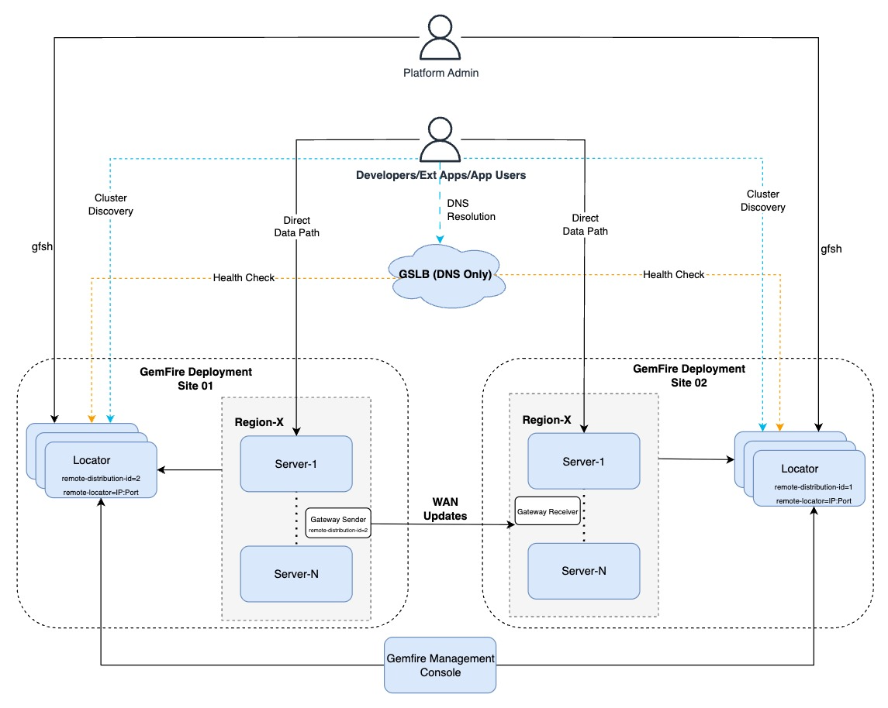

# Tanzu GemFire Logical Architecture

The following overview illustrates the logical architecture of VMware Tanzu GemFire deployed on VMware Cloud Foundation (VCF 9). It highlights how GemFire clusters distributed across multiple sites collaborate to deliver resilient, low-latency, and fault-tolerant data replication across geographically or logically separated environments.

- **Core GemFire Cluster and Data Topology**

  - **Intra-Region Active/Active High Availability**: Within the primary site (Region 1), Tanzu GemFire members, including Locators and Cache Servers, are distributed across multiple Availability Zones. Locators and Servers operate in an Active/Active peer topology. This topology ensures local fault isolation and zero-downtime failover without crossing WAN boundaries.

  - **Inter-Region Asynchronous WAN Replication**: Region 1 (Primary Cluster) and Region 2 (Standby Cluster) operate as independent distributed systems. Gateway Senders and Gateway Receivers manage data synchronization between the regions over non-NATed, L3-routable networks. This asynchronous event queue model keeps the standby site synchronized while isolating site performance and preserving site autonomy during WAN outages.

  - **Decoupled Client Communication** (Two-Phase Path): Native GemFire applications interact with the cluster through a two-phase lifecycle:

    - **Discovery Phase**: The client contacts an active Locator to query cluster topology and receive the address of the least-loaded server.

    - **Direct Data Path**: The client opens direct, long-lived TCP sockets to the designated Cache Servers for all subsequent get, put, and query operations. Locators and Load Balancers do not sit inline on this steady-state data path.

- **Automated Multi-Region Failover (NSX ALB GSLB)**

  To automate disaster recovery without placing inline proxies on the data path, you can optionally integrate NSX Advanced Load Balancer (ALB) as a Global Server Load Balancer (GSLB).

  - **Architectural Role (DNS, Not Proxy):** NSX ALB acts purely as an intelligent DNS router for native GemFire clients. Clients query the GSLB solely to resolve the cluster's domain name into the direct IP addresses of the active Locators. NSX ALB does not sit inline as a proxy for the actual data traffic.

  - **Intelligent Health Checking:** The GSLB continuously monitors the health of the Tanzu GemFire Locator services. The GSLB sends active health probes, for example verifying TCP port availability on port 10334, directly to the Locators in both the primary and standby regions.

  - **Uninterrupted Connectivity:** Because the NSX ALB hands out the actual back-end Locator IPs, native clients can maintain their built-in connection pools and routing mechanisms. This eliminates network bottlenecks and avoids creating a single point of failure (SPOF) in the data path.

- **Alternatives to GSLB (Environments Without NSX ALB)**

  GSLB integration is optional and recommended primarily when you require automated, low-RTO failover. In environments without NSX ALB or GSLB capabilities, you can manage disaster recovery through alternative procedures:

  - **Alternative 1:** Manual DNS Override

    Standard enterprise DNS A-records for `locator.domain.com` map to Region 1 Locators during normal operations. During a declared disaster, network administrators update the DNS records to point to Region 2 Locators. Upon DNS TTL expiration, disconnected clients resolve the new IPs and fail over automatically.

  - **Alternative 2:** Application Configuration Update

    If DNS updates are restricted, administrators update client application properties, for example `gemfire.properties` or Spring Boot configuration, with the Region 2 Locator IPs, then restart the application.

##  Critical Architectural Constraint: Avoid Cross-Site Locator Lists

Never configure clients with a combined list of locators spanning both regions simultaneously (for example, `locators=locator-r01az01-IP[10334], locator-r02az01-IP[10334]`). Because GemFire native clients randomize locator addresses for initial load balancing, a dual-region configuration risks forcing healthy clients in Region 1 to connect to Region 2 servers during normal operations. This can cause severe cross-WAN latency and potential data divergence.

##  Key Components of Tanzu GemFire

This section outlines the core components of Tanzu GemFire. Together, these components provide a distributed, in-memory data management platform optimized for high performance, dynamic scalability, and fault tolerance.

###  Tanzu GemFire Locators

Locators act as the directory and primary cluster coordinators for the GemFire distributed system. Locators help new servers or clients discover the cluster and maintain consistent membership information. Locators do not store application data. Instead, they provide the following essential services:

- Cluster Discovery: Enables new members to find and join the existing cluster.

- Server Location Information: Maintains an up-to-date, shared view of the cluster topology.

- Client Load Balancing: Guides clients to connect with the most suitable, least-loaded cache servers.

Locators form the backbone of cluster formation and communication.

###  Tanzu GemFire Servers

Tanzu GemFire Servers, often referred to as Data Nodes or Cache Servers, are the JVM processes responsible for storing and managing the actual application data.

- Servers host the GemFire regions and execute core data operations, including reads, writes, and query execution.

- Servers manage data replication, redundancy, and distributed caching logic.

- Servers scale horizontally. Adding more servers to a cluster dynamically increases both data capacity and overall processing performance.

###  Tanzu GemFire Regions

A Region is the primary data container in GemFire and is conceptually similar to a highly scalable, distributed Map. Regions define exactly how data is distributed, replicated, stored, and recovered across the cluster.

- Data Model: Stores information as key-value pairs.

- Topologies: Supports Partitioned regions, for horizontal data sharding and high capacity, or Replicated regions, for high-speed read access where every server holds a full copy of the data.

- Storage: You can configure a region as purely in-memory, or persistent on disk for crash recovery.

###  Gateway Sender and Gateway Receiver

These components enable asynchronous, multi-site WAN replication, ensuring cross-site consistency for Disaster Recovery, Active/Active deployments, or geographically distributed systems.

- Gateway Senders: Running on the source cluster, Gateway Senders queue and transmit region events to remote clusters. Gateway Senders support both serial and parallel modes to balance between strict event ordering and high-throughput concurrency.

- Gateway Receivers: Running on the remote destination cluster, Gateway Receivers accept and apply those incoming events to the local regions.

###  Tanzu GemFire Management Console

Tanzu GemFire Management Console is a standalone web application, shipped as a JAR or OCI image, that serves as the central hub for cluster administration, fleet management, and real-time monitoring. Beyond visualization, Tanzu GemFire Management Console enables administrators to execute write operations, for example creating regions, deploying JARs, or managing gateways, and perform centralized log searches.

###  Unified Metrics Exposure (GemFire 10.3 Architecture)

Unlike older versions that required dedicated metrics ports, GemFire 10.3 consolidates observability onto the member's standard HTTP service port. Each member in the cluster natively exposes its statistics (prefixed with `gemfire_`, such as `gemfire_gets`) at the `/metrics` endpoint.

- **Locators:** The `enable-management-rest-service=true` property enables the endpoint by default.

- **Servers:** Appending the `--start-rest-api` flag during startup enables the endpoint.

- **Port Isolation:** To adhere to security best practices, administrators can restrict the HTTP service port to explicitly serve only metrics, disabling the Developer REST APIs, by configuring `http-services=metrics`. Administrators can also tune the emission level per member (`Default`, `All`, or `None`).

###  Prometheus and Grafana Integration

Tanzu GemFire Management Console provides deep observability through a native Prometheus integration.

- **Data Collection (Prometheus):** A Prometheus server, either embedded within Tanzu GemFire Management Console or managed externally by the organization, acts as the time-series database. This server directly scrapes the `/metrics` endpoints on the HTTP service ports of the cluster members.

- **Tanzu GemFire Management Console Visualization:** Tanzu GemFire Management Console actively queries Prometheus using PromQL to populate its Monitoring tab. Tanzu GemFire Management Console organizes these insights into three core areas: Data (throughput, latencies, cache hit ratios), Cluster (memory, CPU, disk utilization, IO waits), and WAN Gateway (receiver throughput and sender queues). The UI provides a viewing window capped at a 7-day history.

- **Grafana Extensibility:** Because Prometheus collects the data natively, organizations can point Grafana directly at the same Prometheus instance. This enables teams to use the full catalog of `gemfire_` metrics to build highly customized, long-term observability dashboards independently of Tanzu GemFire Management Console.

