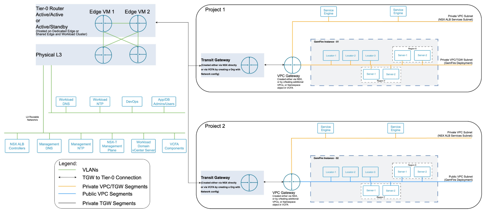

# Tanzu GemFire Network Architecture

The network architecture for Tanzu GemFire on VMware Cloud Foundation (VCF) 9 builds on modern NSX constructs such as Projects, Virtual Private Clouds (VPCs), and optionally the NSX Advanced Load Balancer (NSX ALB) to deliver a secure, scalable, and multi-tenant-ready design. Dedicated resource pools are created for GemFire components so that resources stay clearly separated and the deployment remains easy to operate.

You can deploy Tanzu GemFire clusters on VLAN-backed portgroups. However, this architecture uses NSX Overlay networks exclusively to maximize cloud-native agility and security.

You can create three types of overlay network within a VPC:

1. VPC Private Networks (Private VPC Segments)

   - Scope: a single VPC only.

   - Routing: The VPC Gateway isolates these networks. The VPC Gateway does not advertise their prefixes to Transit Gateways (TGW) or Tier-0 Routers.

   - East-west domain: confined to that VPC.

   - Not reachable from other VPCs or Regions.

2. Private TGW Networks (Project Shared Networks)

   - Scope: shared within a Project across multiple VPCs.

   - Routing: The Transit Gateway (TGW) connects the VPC Gateways of every VPC in the same Project.

   - Not advertised outside the Project, and not leaked to the Tier-0 or upstream networks.

   - Ideal for intra-Project communication across multiple VPCs.

3. Northbound-Routable Public Networks (Public VPC Segments)

   - Scope: a VPC network with upstream reachability.

   - Routed path:  
     Segment → VPC Gateway → TGW → T0 Gateway → Uplink L3

   - Reachability: The Tier-0 exports these prefixes northbound to L3 networks, for example WAN, MPLS, or VPN.

   - "Public" here means northbound-routable, not necessarily internet-facing.

##  Supported Network Topologies

The network diagram shows that GemFire clusters can be placed on three distinct network scopes: Private VPC segments, Project-level TGW segments, or northbound-routable Public segments.

- Project 1 in the diagram shows GemFire clusters deployed on Private VPC or TGW networks.

- Project 2 shows a GemFire cluster hosted on Public segments.

###  Design Recommendation

For the evaluated VCF-based architecture, placing GemFire clusters on Public segments is the recommended approach, because their broader reachability suits multi-Project and multi-Region designs. The diagram deliberately shows all three models to illustrate the full range of supported options and where each applies.

This section explains how GemFire operates across the three supported network topologies:

- GemFire on VPC private segments (single-VPC scope)

- GemFire on private TGW segments (Project scope, multi-VPC)

- GemFire on northbound-routable Public segments (inter-Project / inter-Region)

###  Tanzu GemFire on VPC private segments (single-VPC scope)

Use VPC Private segments when all GemFire components, including Locators, Cache Servers, Gateway Senders, Gateway Receivers, and clients, belong to a single cluster that operates entirely inside one VPC. The VPC Gateway routes these segments only within the VPC. The VPC Gateway does not advertise their prefixes to the TGW or the Tier-0, so the segments remain fully isolated within that VPC's routing domain.

When to use:

- This topology is fully supported only when the WAN peer cluster is also inside the same VPC, because all communication uses local, non-NATed IPs.

- This topology is not suitable for cross-VPC, cross-Project, or cross-Region replication.

- You cannot use Private VPC prefixes for external WAN replication. Their routes never leave the VPC Gateway, so they can never reach remote Gateway Receivers or remote Locators.

###  Tanzu GemFire on Private TGW Segments (Project scope, multi-VPC)

Use Private TGW segments when GemFire clusters or remote GemFire clients span multiple VPCs within the same NSX Project. TGW segments provide L3 connectivity across every VPC attached to the same Transit Gateway while remaining isolated to that Project.

When to use:

- You deploy primary and secondary clusters in different VPCs but inside the same NSX Project, for example different AZs, vSphere clusters, or VCF Workload Domains mapped into separate VPCs.

- All GemFire clients run inside the same Project, on the same or different VPCs.

- You must enable cross-VPC communication within the Project, without exposing those networks outside the Project boundary.

WAN Replication Characteristics:

- This topology fully supports intra-Project WAN replication where the WAN peer cluster resides in another VPC attached to the same TGW.

- The TGW does not advertise its prefixes outside the Project, so you cannot use them for cross-Project replication, cross-Region replication, or any topology requiring northbound L3 routing. For those cases, use Public segments.

###  Tanzu GemFire on Northbound-Routable Public Segments (inter-Project / inter-Region)

Host all GemFire components on Public VPC networks when remote GemFire clients fall outside the current NSX Project, or when GemFire peers live on a different NSX overlay zone or NSX Manager. Examples include another Project, another VCF Region, or a physical L3 domain.

The VPC Gateway advertises Public prefixes to the TGW, then to the centralized Tier-0, which exports the prefixes to uplink L3. This design makes GemFire member IPs reachable across WAN, MPLS, VPN, and inter-DC paths without NAT. GemFire intra-cluster and WAN communication has a hard requirement for this reachability.

When to use:

- Remote GemFire clients or WAN-peer clusters reside outside the current Project. Examples include another NSX Project in the same Region, another NSX Manager or overlay zone, a different VCF Region with its own NSX Manager and overlay fabric, or physical or legacy L3 networks reached over routed WAN.

- Routing between clusters or clients must occur over northbound L3 paths rather than east-west overlay transport, because the environments do not share a common Geneve fabric.

- You must configure WAN replication or client access across administrative or regional boundaries where only traditional routed L3 connectivity exists.

WAN Replication Characteristics:

- You must configure this topology for cross-Region or cross-NSX-domain replication. NSX overlays cannot stretch between Regions or between NSX Managers, so Private VPC or Private TGW segments are not reachable from a remote Region.

- You must advertise Public prefixes to the Tier-0 and export them to the physical WAN so that Gateway Senders can initiate connections to remote Gateway Receivers, and remote clusters can reach each Locator and Cache Server on its real, non-NATed IP.

- This design gives a clean, direct L3 route between all GemFire members participating in WAN replication, meeting GemFire's requirement for end-to-end local IP reachability.

##  Generic Network Recommendations

GemFire clusters can be hosted on any of the overlay networks above. Regardless of the chosen network, follow these recommendations.

###  Segment placement

- Place all members, Locators and Servers, of a given cluster on a single NSX segment per cluster, rather than spreading one cluster across multiple routed segments. This design keeps intra-cluster traffic at L2 within the overlay.

  Doing so also minimizes hop-by-hop routing through the distributed logical router datapath, reducing latency and jitter.

- If you deploy multiple GemFire clusters in the same NSX Project, use a separate segment or VPC per cluster for isolation, but avoid unnecessary segmentation inside a single cluster unless a clear security requirement exists.

- Secure and restrict access with Distributed Firewall (DFW) rules scoped to the segments and subnets hosting GemFire. Open only the required ports between Locators, Servers, and WAN peers. See [Port Configuration for Tanzu GemFire](#port-configuration).

#### Client/server connection model (how clients reach the cluster)

- In a standard client and server network setup, clients contact Locators strictly to find services and retrieve load details such as startup, membership, and failover handling. Locators never handle the ongoing data traffic.

- After discovery, the client connection pool opens direct TCP connections to one or more Cache Servers. All reads, writes, queries, and events flow directly over those server connections.

  Locators provide the pool with the least loaded server, and the pool connects directly from that point onward.

- With single-hop or partition-aware routing (`pr-single-hop-enabled`), the client pool connects to every server that hosts data, so firewall rules must allow client-to-server reachability to the full server set, not just a subset.

- Both the discovery path (client to Locator) and the data path (client to every Server) must be open through the firewall. A client that can reach Locators but not Servers, or Servers but not Locators, will fail to connect.

###  Do not NAT GemFire member traffic

- Never NAT core GemFire member-to-member, client-to-server, or gateway sender or receiver traffic. Locators and Servers advertise and rely on real VM IPs. SNAT and DNAT break membership, server discovery, single-hop routing, and WAN replication.

- GemFire does not support front-ending the native GemFire client data path with an L4/L7 VIP, because clients must reach individual server IPs directly. A load-balancer VIP, for example NSX ALB, is appropriate for the HTTP/REST management and developer API path, not for native client traffic.

- GSLB in this design is DNS-only. GSLB resolves clients to Locator endpoints, and clients then connect directly to Locators and Servers on their real IPs.

###  Socket and buffer tuning

These settings are relevant when planning ephemeral-port ranges and DFW rules.

- GemFire assigns *ephemeral* ports for peer membership and TCP failure detection. Behind a firewall, constrain the `membership-port-range` to a bounded window and pin `tcp-port` per member, then open exactly that range between members.

- `conserve-sockets` defaults to `false`, which gives each application thread its own send and receive sockets to each peer. This setting maximizes throughput but increases the number of concurrent inter-member TCP connections. Size the `membership-port-range` and OS socket limits accordingly. For any member participating in a WAN deployment, keep `conserve-sockets=false`.

- Match `socket-buffer-size` across the deployment. The peer-to-peer setting in `gemfire.properties` should be consistent cluster-wide, and the client pool's `socket-buffer-size` should match the Servers' setting.

  Buffers should be at least as large as your largest stored object plus its key and approximately 100 bytes of header overhead. The system rejects requests above the OS limit at startup, so coordinate with your platform team on OS buffer maximums.

###  Network Recommendations for WAN replication within a single region

- **Primary and secondary Tanzu GemFire clusters in the same VPC**

  When both the primary and secondary GemFire clusters reside in the same VPC, place all GemFire components, locators and servers for both clusters, on private VPC segments.

  In this model, both clusters share the same underlying NSX overlay and Project/TGW, but you can still back them with different vSphere clusters or AZs for fault isolation. GemFire traffic stays within the private VPC overlay and uses local IPs for WAN replication.

- **Primary and secondary Tanzu GemFire clusters in different VPCs (same Project)**

  When the primary and secondary clusters are in different VPCs but within the same NSX Project, place all GemFire components on Private Transit Gateway (TGW) segments rather than VPC private segments.

  Private TGW segments are routed via the Project's Transit Gateway and are reachable from multiple VPCs attached to that TGW, but their routes are not advertised beyond the Project. This design preserves multi-tenant isolation while allowing clusters in different VPCs to communicate over local IPs.

  The clusters can reside in different AZs and vSphere clusters, but they still share a common underlay and Project-level routing domain, which satisfies GemFire's requirement for direct IP reachability between WAN peers.

###  Network Recommendations for WAN replication across multiple regions

- In a multi-Region VCF topology, each Region has its own NSX Manager and overlay control plane, so overlay segments do not stretch between Regions. As a result, GemFire local IPs from Region A are not natively routable in Region B.

- To enable cross-Region WAN replication, deploy the clusters in each Region on Public VPC segments, see GemFire Instance 02 in the diagram, that are advertised northbound from the Tier-0 to the physical or upstream routers.

- Configure inter-Region routing so the advertised subnets are mutually reachable at L3, with no stateful NAT on the GemFire traffic path. From GemFire's perspective, remote members must be reachable by their actual IP addresses.

- Ensure the end-to-end path between Regions, including physical routers, firewalls, and WAN links, meets GemFire's latency and bandwidth requirements. WAN replication throughput and catch-up time depend directly on network quality.

## Network design decisions for GemFire on VCF 9 (NSX VPC/Projects)

Based on the preceding recommendations and topology options, the following table summarizes the key network design decisions for deploying GemFire instances on the VCF 9 platform.

| Decision / Pattern | Recommendation | Rationale | GemFire requirement / impact |
| ----- | ----- | ----- | ----- |
| Segmentation for a GemFire cluster | Place all members (Locators and Servers) of a given cluster on a single NSX Geneve segment per cluster. | Keeps intra-cluster traffic at L2 in the overlay, minimizes routing hops through the distributed router datapath, and simplifies firewalling and troubleshooting. | Reduces latency and jitter for membership, replication, and client traffic; avoids asymmetric routing between members. |
| Multiple clusters in the same Project | Use separate NSX segments per cluster, but avoid splitting a single cluster across multiple segments unless required by security policy. | Provides isolation between clusters while keeping each cluster's traffic flat. | Prevents cross-cluster interference while keeping per-cluster topology simple for WAN and client configuration. |
| Addressing model for WAN replication | Use the local IPs of GemFire members (VM addresses) for WAN replication, avoid NAT on GemFire control/data paths. | GemFire WAN gateways expect peers to be reachable on their configured IPs. NAT can break membership, gateway sender/receiver connectivity, and conflict resolution.  | Ensures stable WAN links, predictable failover, and supported behavior for multi-site topologies. |
| Client data-path reachability | Ensure clients can reach Locators (discovery) *and* every Cache Server (data) directly; do not place native client traffic behind a VIP/NAT. | Clients use Locators only for discovery, then open direct pool connections to servers; single-hop connects to every data-hosting server. | Prevents connection failures and broken single-hop routing; keeps the L4/L7 VIP scoped to the HTTP/REST path only. |
| Intra-region WAN: clusters in the same VPC | When primary and secondary clusters are in the same VPC, place all locators and servers on private VPC segments. | Both clusters share the same NSX overlay and Project/TGW; routing is straightforward and stays within the VPC's private address space. | Satisfies requirement for local IP reachability while allowing clusters to be in different AZs / vSphere clusters within the region. |
| Intra-region WAN: clusters in different VPCs (same Project) | When clusters are in different VPCs but the same Project, host GemFire components on private Transit Gateway (TGW) segments rather than per-VPC segments. | TGW segments are reachable from multiple VPCs attached to the Project TGW, but routes are not advertised beyond the Project, maintaining isolation while enabling cross-VPC communication. | Allows GemFire WAN peers in different VPCs to communicate via local IPs without NAT, while preserving Project-level multi-tenancy. |
| Inter-region WAN | For clusters in different regions (separate NSX managers/overlays), place GemFire components on VPC segments that are advertised from T0 to upstream routers ("public"/externally routable networks). | Overlays are not stretched between regions; you must configure L3 routing between advertised subnets for reachability. | Provides direct L3 connectivity between member IPs across regions; this topology requires supported multi-region WAN topologies. |
| Inter-region routing behavior | Ensure end-to-end L3 reachability between GemFire subnets across regions, without stateful NAT on GemFire ports; use routing/ACLs instead. | Preserves true member IPs end-to-end, avoids session breakage, and simplifies WAN gateway configuration. | WAN gateways can connect reliably; reduces operational complexity in diagnosing replication issues. |
| Network quality for WAN links | Design WAN paths with sufficient bandwidth and low, predictable latency between regions/cluster sites. | WAN replication throughput and queue drain time are directly affected by RTT, jitter, and available bandwidth. | Critical for keeping secondary clusters current, minimizing lag and recovery time in failover scenarios.  |
| NSX and overlay use | Use NSX VPC/Projects, VPC Gateways, and TGW as the routing fabric; central T0 provides north-south connectivity. | Aligns with VCF 9 VPC model (VPC Gateway to TGW to centralized T0), and keeps GemFire traffic within well-defined routing domains. | Ensures that GemFire clusters can be placed flexibly across AZs/VPCs while maintaining supported network semantics.  |

##  Monitoring and Metrics Exposure (Prometheus)

The **Tanzu GemFire Management Console** provides monitoring for this architecture. It is a standalone web application, distributed as a JAR or OCI image. It runs alongside the clusters and integrates with a Prometheus server to drive its monitoring dashboards.

Beginning with **GemFire 10.2**, the metrics architecture changed, and this change has a direct firewall and port impact:

- Each GemFire member, Locator and Server, exposes its Prometheus metrics at the `/metrics` path on the member's **HTTP service port** (`http-service-port`, default 7070), a dedicated metrics port. Metric names are the GemFire statistics prefixed with `gemfire_` (for example, the `gets` statistic is exposed as `gemfire_gets`).

- GemFire serves the metrics endpoint only when the member's HTTP service is enabled: on Locators via `enable-management-rest-service` (default `true`), and on Servers via `--start-rest-api` (default `false`, must be enabled explicitly). The `gemfire.prometheus.metrics.emission` property (`Default` / `All` / `None`) controls metric emission per member.

- The Prometheus server, either the embedded Prometheus that Tanzu GemFire Management Console can auto-start for OVA/OCI installs, or an external, org-managed Prometheus, scrapes each member on `http-service-port` `/metrics`. Tanzu GemFire Management Console then queries Prometheus to render the Monitoring tab. Grafana can attach to the same Prometheus for custom dashboards.

- If cluster security is enabled, the metrics endpoint requires the `CLUSTER:READ` permission and honors the cluster's TLS/SSL configuration. The scraper, Prometheus or Tanzu GemFire Management Console, must be permitted and, where applicable, present valid credentials or certificates.

###  Firewall implications for metrics

The monitoring path requires that the Prometheus server, or Tanzu GemFire Management Console's embedded Prometheus, reach **every** GemFire member on `http-service-port` (7070). This requirement applies in addition to any existing REST or management use of port 7070. The `/metrics` traffic is HTTP(S), and you must not NAT it away from the member's real IP, since Prometheus targets the members directly.

##  Firewall Requirements for Tanzu GemFire

The following table lists the minimum firewall rules needed to support communication between components in the architecture.

The following firewall requirements assume that all GemFire components are on a single network. If your design uses multiple networks or DFW, see the next section, [Port Configuration for Tanzu GemFire](#port-configuration).

| Source | Destination | Protocol:Port | Description |
| ----- | ----- | ----- | ----- |
| GemFire Network (Locators + Servers) | DNS Server(s) | TCP/UDP:53 | Name resolution for GemFire members. |
| GemFire Network (Locators + Servers) | NTP Server(s) | UDP:123 | Time synchronization — required for reliable membership/failure detection and for correlating log timestamps across members. |
| Native Client / App network CIDR(s) | GemFire Locators | TCP:10334 | Cluster discovery, membership, and failover routing. Bootstrap only — Locators do not carry the steady-state data path. |
| Native Client / App network CIDR(s) | GemFire Servers | TCP:40404 | Direct client data path (pool and subscription connections). Native clients connect directly to the Servers; single-hop routing requires reachability to every data-hosting Server. |
| Non-native / REST Clients | GemFire Servers (and Locators) | TCP:7070 | Optional — only when the HTTP/REST endpoint is enabled for non-native clients. REST clients reach the member's `http-service-port` directly; GemFire is not fronted by a VIP or inline proxy. |
| Platform / DB Admin | GemFire Network (Locators + Servers) | TCP:10334, TCP:7070, TCP:1099 | Admin access for LCM and troubleshooting: `gfsh` discovery via the Locator (10334), the management REST API via the `http-service-port` (7070), and JMX via the JMX Manager RMI port (1099). Use HTTP mode (7070) to avoid the extra ephemeral RMI connector port that JMX (1099) requires behind a strict firewall. |
| Admin / User network | Tanzu GemFire Management Console | TCP:8080 | Access to Tanzu GemFire Management Console web UI (port configurable via `server.port`). |
| Tanzu GemFire Management Console | GemFire Network (Locators + Servers) | TCP:10334, TCP:7070 | Cluster connection via Locator, plus the management REST API and metrics on `http-service-port`. |
| Prometheus / Tanzu GemFire Management Console embedded Prometheus | GemFire members (Locators + Servers) | TCP:7070 | Scrapes the `/metrics` endpoint on each member's `http-service-port`. (Scrape path varies by monitoring deployment mode — to be finalized in the monitoring section.) |
| Tanzu GemFire Management Console | External Prometheus server | TCP:9090 | PromQL queries to render dashboards (only when an external Prometheus is used). |

###  Port number defaults

All GemFire port numbers in this table are the product defaults for Tanzu GemFire 10.3. If you have changed any corresponding setting in your deployment, substitute your configured value. [Port Configuration for Tanzu GemFire](#port-configuration) documents the setting name and how to change each port, and is the authoritative reference for these flows. Tanzu GemFire Management Console web UI port and the Prometheus port are likewise defaults (`8080` via `server.port` and `9090` for Prometheus), and you should replace them if you have overridden them.

###  Optional: NSX ALB GSLB (DNS-based multi-region failover)

GemFire is never placed behind a load-balancer VIP. Native clients always connect directly to Locators and Servers on their real IPs. NSX Advanced Load Balancer is an optional component, integrated only as a Global Server Load Balancer (GSLB) to automate multi-region failover.

In this role, GSLB acts purely as an intelligent DNS router. GSLB resolves the cluster's domain name to the real IPs of the active Locators and is never inline on the data path, so GSLB introduces no bottleneck or single point of failure in the data path. If you adopt GSLB, two additional flows apply:

| Source | Destination | Protocol:Port | Description |
| ----- | ----- | ----- | ----- |
| Native Clients | GSLB VIP (NSX ALB) | UDP/TCP:53 | DNS resolution of the cluster domain name to the active Locators' real IPs. |
| GSLB (NSX ALB) | GemFire Locators (primary + standby regions) | TCP:10334 | Health probes that verify Locator availability and steer DNS toward the active region. |

A manual DNS override or application-level configuration achieves the same client-side result. NSX ALB's own management-plane connectivity, including vCenter, AD/LDAP, and Service Engine lifecycle, is out of scope for GemFire documentation.

##  Port Configuration for Tanzu GemFire

If your environment uses segmented networks or DFW, ensure the following port configurations are in place for Tanzu GemFire to function correctly. Defaults below reflect Tanzu GemFire 10.3.

| Name | Source to Destination | Protocol | Default | Configuration | Description |
|---|---|---|---|---|---|
| Locator Port | Clients, Cluster members to Locator | TCP | `10334` | `--port` on `gfsh start locator` (or `start-locator` for embedded locators) | Cluster discovery and client bootstrap. Clients contact Locators only for discovery and load information, not for the steady-state data path. |
| Cache Server Port | Client applications to Server;  Server <-> Server | TCP | `40404` | `port` in `<cache-server>` (`cache.xml`), the `CacheServer` API, or `--port` on `gfsh start server` | Native client pool and subscription connections, and server-to-server communication. This acts as the direct client data path (after Locator discovery). |
| HTTP Service Port | REST clients, Tanzu GemFire Management Console, Prometheus to Locator / Server | TCP (HTTP/HTTPS) | `7070` | `http-service-port` in `gemfire.properties` | Serves the REST management/developer API and the Prometheus `/metrics` endpoint (GemFire 10.2 or later). Enable on Servers with `--start-rest-api`; on Locators via `enable-management-rest-service` (default `true`). Must be open wherever REST or metrics scraping is used. |
| Membership Port Range | Servers and Locators <-> Servers and Locators (same cluster) | TCP | `41000-61000` | `membership-port-range` in `gemfire.properties` | Ephemeral ports for peer membership and TCP failure detection. Must be open bidirectionally between all Servers and Locators of the same cluster. Narrow this range behind a firewall, sized for member count × per-thread sockets (see `conserve-sockets`). |
| TCP Port | Servers and Locators <-> Servers and Locators | TCP | ephemeral (OS-assigned) | `tcp-port` in `gemfire.properties` | Direct TCP port for peer cache communications. If `0`, the OS selects a port; pin it per member behind a firewall so the assigned ports can be allowed. |
| JMX Manager Port (RMI) | JMX admin tools (e.g., JConsole) or running `gfsh` from jump-boxes to Locators / JMX Manager Nodes | RMI/TCP | `1099` | `jmx-manager-port` in `gemfire.properties` | Facilitates native Java RMI administrative sessions (`gfsh`) and JVM diagnostic tools (JConsole, VisualVM).  When `gfsh` initiates a connection via the Locator port (10334), the Locator performs an internal handoff and redirects the active management connection to the JMX Manager on port 1099. Not required by Tanzu GemFire Management Console (which uses the REST/`http-service-port` path). |
| Memcached Port | Memcached clients to Server | TCP | *not set* | `memcached-port` in `gemfire.properties` | Optional. Disabled by default; enable explicitly to support Memcached-protocol access for legacy PHP, Python or Ruby applications that use Memcached libraries. |
| Gateway Receiver Port Range | Remote Gateway Sender (peer site) to local Gateway Receiver | TCP | `5000–5500` | `start-port` / `end-port` in `<gateway-receiver>` (`cache.xml`), or `--start-port` / `--end-port` on `gfsh start gateway-receiver` | Inbound WAN event traffic. The receiver binds one port from this range at startup; open the full range from the remote site's Gateway Senders. |
| Gateway Sender Connection | Gateway Sender (active site) to Gateway Receiver (peer site) | TCP | (target = receiver range) | `hostname-for-senders` in `<gateway-receiver>` advertises the address senders connect to | Where Senders initiate WAN event transfer; targets the peer site's Gateway Receiver port range. |
| Remote Locator Discovery | Locator (site A) to Locator (site B) | TCP | `10334` | `remote-locators` in `gemfire.properties` | Enables WAN site discovery between Locators across sites. |
| Tanzu GemFire Management Console (Web UI) | Admins / Users to Tanzu GemFire Management Console | TCP (HTTP/HTTPS) | `8080` | `server.port` (JAR/OCI env) | Tanzu GemFire Management Console web interface. Port is configurable. |

This configuration lets Tanzu GemFire communicate securely and efficiently across client/server, monitoring, and multi-site (WAN) topologies, even in highly restricted or segmented network environments. Correct firewall rules and port allowances are essential for reliable peer discovery, data replication, client interaction, and metrics collection.

