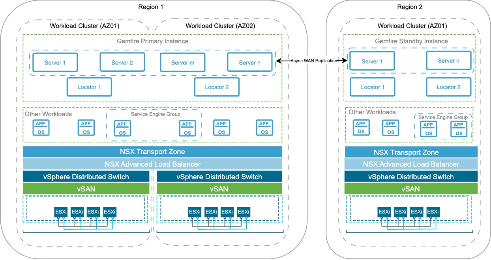

# Tanzu GemFire on VCF 9 Platform Architecture

 

The following design illustrates the Platform Architecture of VMware Tanzu GemFire deployed on the VMware Cloud Foundation (VCF) platform, spanning multiple vSphere Workload Clusters that function as independent Availability Zones (AZs). This architecture demonstrates how GemFire achieves high availability. The deployment can withstand the failure of an entire AZ or even an entire region, while supporting a highly available, fault-tolerant Active–Standby topology suitable for mission-critical workloads.

In addition to failure resilience, the architecture supports scalability, allowing GemFire clusters to expand horizontally across AZs and regions. Distributed GemFireServer nodes and redundant Locator instances enhance redundancy and ensure consistent performance under variable load. NSX-T provides consistent networking, and VCF offers standardized lifecycle management. Together, these components deliver a robust foundation for deploying, scaling, and operating high-performance GemFire environments at enterprise scale.

##  VCF Platform Architecture Overview

1. Multi-Region, Multi-AZ Design for Resiliency

    The deployment spans two geographic regions to provide strong resilience and fault tolerance.

   1. Region 1 includes two Availability Zones (AZs), each implemented as an independent vSphere cluster with its own compute resources, VMware Distributed Switch (VDS), and storage. Although the diagram illustrates vSAN, you can use any vSphere-supported datastore, such as vSAN, NFS, VMFS, or vVols. If you use GemFire features such as Persistence and Overflow, use storage types with low latency and high IOPS, such as vSAN, SSDs, direct-attached storage, or optimized block devices. You can use NFS, but Broadcom generally does not recommend NFS for primary persistent storage in high-throughput GemFire environments, due to potential network and latency bottlenecks.

   2. Region 2 is designed as a simplified disaster recovery site with a single AZ.

2. Workload Domain and vCenter Placement

   All AZs within a region are grouped under a single workload domain, managed by a Workload vCenter deployed in the management domain. Each vSphere cluster acts as a separate AZ, providing clear fault isolation and infrastructure-level high availability. An alternative design uses a dedicated workload domain and vCenter per AZ, however, for the purpose of this documentation, the architecture here uses a single workload domain.

3. Consistent Networking Across AZs

   1. NSX-T overlay networking stretches seamlessly across all AZs within each region, providing uniform, software-defined connectivity so GemFire workloads can communicate reliably regardless of their physical placement. This architecture includes NSX-T constructs such as VPCs and Projects, enabling logical isolation, multi-tenancy, and cleaner organization of network objects within the VCF environment.

   2. In environments using VLAN-backed port groups instead of NSX overlays, the topology is equally supported. In such cases, ensure proper L3 routing between AZs and regions so that GemFire nodes can maintain stable, low-latency communication across all failure domains.

4. Optional Load Balancing with NSX Advanced Load Balancer

   Integrating NSX Advanced Load Balancer (ALB) to act as a Global Server Load Balancer (GSLB) provides automated, multi-region failover for Tanzu GemFire. However, the GSLB operates strictly at the DNS layer, not the data layer.

##  GemFire Deployment Model

1. Primary GemFireCluster Across Multiple AZs (Region 1)

   The primary GemFire cluster is deployed across both AZs in Region 1. Based on the GemFire region configuration, synchronous replication is enabled between GemFire servers in these AZs, ensuring consistent, highly available data within the region.

2. High Availability for GemFireLocators

   Each AZ in Region 1 hosts a dedicated GemFire Locator. All Locators operate in an active role at the same time. If an AZ or Locator fails, clients use another available locator in their configured list to discover the available cache servers to connect to.

3. Distributed Server Nodes for Resilience and Performance

   Multiple GemFire server nodes are deployed and balanced across the AZs in Region 1. This layout maximizes resource utilization and ensures high availability without risk of data loss.

4. Standby GemFireCluster in Region 2

   Region 2 hosts a secondary GemFire cluster, serving as the disaster recovery environment. The secondary GemFire cluster remains ready to take over in the event of a full regional failure.

5. Cross-Region Protection Using WAN Replication

   Asynchronous WAN replication, a native capability in GemFire, replicates data from Region 1 to Region 2.

##  Key Features of Tanzu GemFire

- **High Read-and-Write Throughput**: Tanzu GemFire supports high throughput with fast data access, thanks to concurrent memory structures and optimized distribution. Data can be replicated or partitioned across systems to improve read and write speeds. This setup boosts overall throughput, with limits only dependent on network capacity.

- **Low and Predictable Latency**: With a streamlined caching layer, Tanzu GemFire minimizes delays by reducing context switches between threads. Data is efficiently distributed, and subscription management ensures better CPU and bandwidth usage, resulting in faster response times and lower latency.

- **High Scalability**  
  Tanzu GemFire can scale easily by distributing data across multiple servers, ensuring balanced load and consistent performance. As demand grows, the system can dynamically add servers, manage data copies, and handle bursts of traffic without sacrificing response time.

- **Continuous Availability**  
  Tanzu GemFire ensures high availability with data replication and failover mechanisms. Data can be saved on disk synchronously or asynchronously, and if a server fails, another takes over to ensure continuous service without data loss or interruptions.

- **Reliable Event Notifications**  
  Tanzu GemFire provides a reliable publish/subscribe system that ensures events are delivered with the related data to subscribers. This eliminates the need for separate database access, offering faster, more efficient event processing.

- **Parallelized Application Behavior on Data Stores**  
  You can execute business logic across multiple system members, improving efficiency by processing data where it is stored. This reduces network traffic and speeds up calculations, making operations faster, especially for data-heavy tasks.

- **Shared-Nothing Disk Persistence**  
  Each Tanzu GemFire member manages its own data storage, ensuring that disk or cache failures in one member do not affect other members. This "shared nothing" approach increases performance and reliability by isolating disk management.

- **Reduced Cost of Ownership**  
  With tiered caching, Tanzu GemFire reduces costs by using local memory caches and minimizing the need for frequent database access. This lowers overall transaction costs and improves efficiency by avoiding costly database operations.

- **Single-Hop Capability for Client/Server**  
  Tanzu GemFire enables clients to directly access the server holding their data, avoiding multiple hops. This improves performance by making data access quicker and more efficient.

- **Client/Server Security**  
  Each user in a client application is given access to a specific subset of data, enhancing security and control. Users are authenticated with their own credentials, ensuring data privacy and proper access levels across the system.

- **Multisite Data Distribution**  
  Tanzu GemFire supports data distribution across geographically dispersed sites. Using gateway sender configurations, the system ensures reliable communication between data centers, enabling scalability without sacrificing performance or data consistency.

- **Continuous Querying**  
  Tanzu GemFire continuously runs complex queries, enabling real-time data updates for applications. `Object Query Language (OQL)` achieves this by simplifying queries for dynamic, real-time data processing.

- **Heterogeneous Data Sharing**  
  Applications written in different languages (C#, C++, Java) can share business objects seamlessly without needing complex transformation layers. Changes in one application automatically trigger updates in others, facilitating smooth integration between different platforms.

