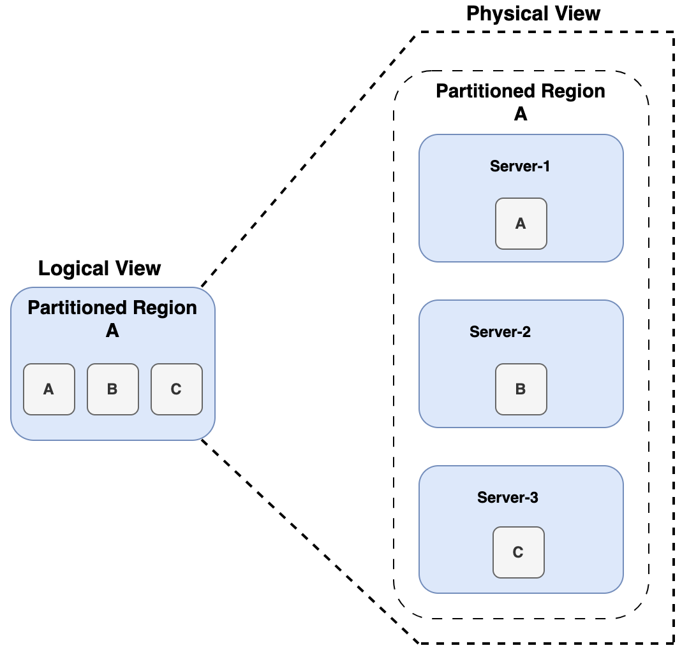
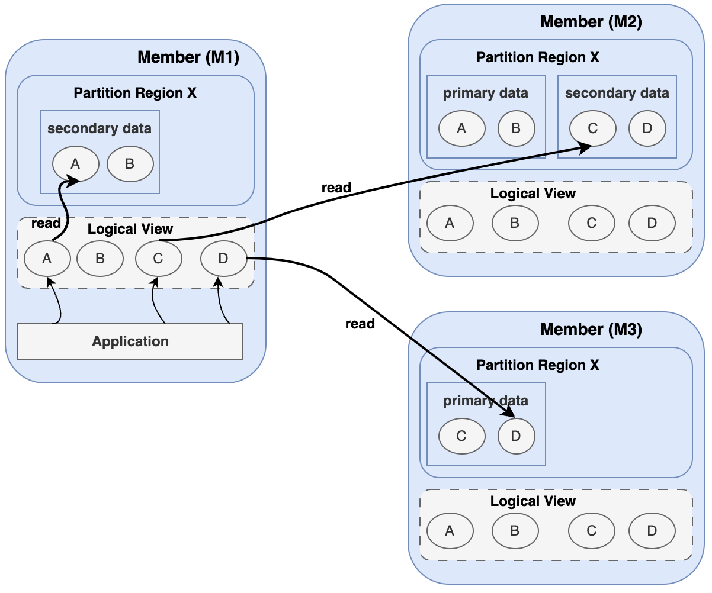
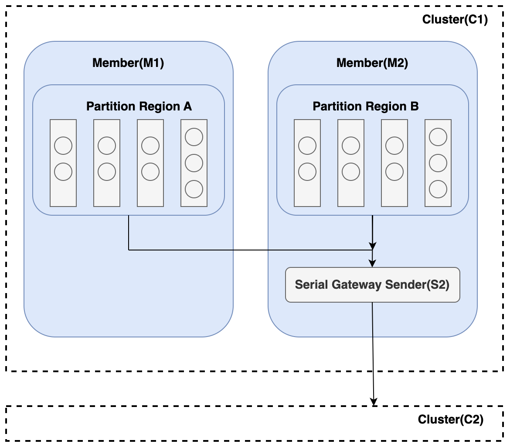
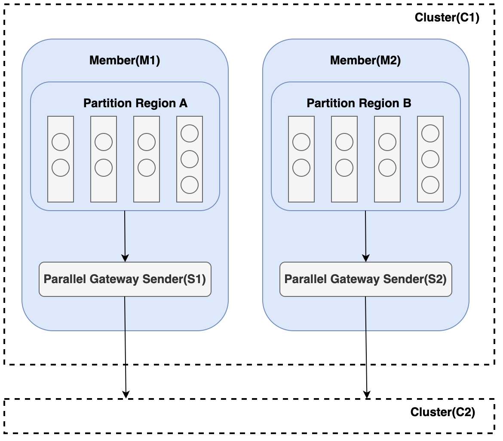

# Tanzu GemFire Server

A Tanzu GemFire Server is a process that hosts data regions, performs read and write operations, and serves requests from both clients and peer members. A server:

- Hosts data regions, the in-memory equivalent of tables or datasets.

- Accepts client connections, processes queries, and returns results.

- Participates in distributed caching, function execution, event propagation, and WAN replication.

- Works with locators to provide high availability and scalability.

##  Recommendations for deploying Servers

- **Deploy at least three servers per cluster.** Three or more servers provide data redundancy and fault tolerance. This configuration also gives the network-partition-detection weighting enough members to avoid split-brain issues.

- **Run servers on separate VMs or hosts from locators** to avoid resource contention and improve stability.

- **Choose region types deliberately:** partitioned regions for scalable data distribution, replicated regions for smaller, critical datasets.

- **Allocate dedicated CPU and memory** to handle data-intensive workloads efficiently. See the [Platform Recommendations](./platform-recommendations-for-tanzu-gemfire-on-vsphere.md) section.

- **In WAN environments,** ensure stable, low-latency links between sites for reliable replication.

##  Tanzu GemFire Regions

A region is a distributed, in-memory data structure similar to a map. Cache servers host regions, which store and serve application data. Regions come in two primary types, distinguished by how data is distributed across servers.

###  Partitioned Region

A Partitioned Region divides its data across multiple servers. Each server holds only a subset (a partition) of the data and, optionally, redundant copies of other servers' partitions for fault tolerance. Internally, the data is split into units of storage called buckets, which are spread across the members hosting the region.

  
The partitioned structure is invisible to the application. The region appears as a single logical dataset, fully accessible from any member, even if that member stores only part of the data locally. Memory usage is configurable per server per region. A cluster can host many partitioned regions, a server can host many regions at once, and partitioned and replicated regions can coexist in the same cluster.

###  Summary

- Data is partitioned across multiple servers. Throughput for get and put operations scales as members are added.

- Supports configurable redundancy through backup copies.

- Well suited to large datasets and write-heavy workloads.

#### High Availability for Partitioned Regions 

In a highly available partitioned region, each member holds a mix of primary and secondary, or redundant, copies. This mix lets the region keep operating without interruption if a member fails. If the member hosting a primary copy is lost, GemFire promotes a secondary copy to primary. This promotion temporarily reduces redundancy, but does not cause data loss. The system then restores redundancy by assigning another member as secondary and copying the data to it. Recovery can happen immediately or after a configurable wait, and GemFire also attempts recovery during rebalancing. Redundancy does not make data loss impossible: if enough members fail within a short enough interval, cached data can still be lost.

###  Read and Write Behavior in HA Regions

GemFire handles reads and writes differently in partitioned regions with redundancy:

- **Read operations** go to any member holding a copy, with the local cache favored. If a member has the entry locally, the member reads the entry directly. Otherwise, the member fetches the entry from another member that holds a copy, chosen at random. Favoring local copies lets read-intensive systems scale across members. In the figure, M1 reads three keys: key A from its own local copy, and keys C and D from other copy-holders selected at random.

  

- **Write operations**, such as put and create, go to the primary copy of the key. GemFire then distributes the write synchronously to all redundant copies. GemFire delivers events to members and clients according to their configured subscription attributes.

This approach enables high availability and strong consistency without sacrificing performance.

###  Replicated Region

A Replicated Region gives every hosting server a full copy of the data. When an entry is created or updated on one server, GemFire automatically propagates the change to all other servers hosting that region.

  
As every hosting server has the complete dataset, replicated regions offer strong availability and very low-latency local reads. Replicated regions are best suited to small and medium-sized datasets, since replicating large volumes across many servers consumes memory and bandwidth.  
Summary:

- The entire dataset is replicated across all hosting members.

- Provides high availability and low-latency local reads.

- Ideal for read-heavy or globally-needed data, for example, reference data such as currency or rate tables.

- Best for small to medium data volumes.

###  Region variants

All region types are built on the partitioned or replicated models, with added capabilities. Common variants include `PARTITION_PERSISTENT`, which is partitioned with disk persistence, `REPLICATE_PERSISTENT`, which is replicated with disk persistence, and `LOCAL`, which is confined to a single member and not distributed.

##  Tanzu GemFire Gateway Senders and Receivers

In a WAN (Wide Area Network) configuration, Gateway Senders and Gateway Receivers implement cross-site data replication. Senders act as outbound pipelines, transmitting region events from one cluster to another. On the receiving end, Gateway Receivers accept those events and apply the changes to their local regions. You configure both Gateway Senders and Gateway Receivers in the server layer.  
You can configure:

- Multiple gateway senders, to replicate data to different remote clusters.

- Parallel gateway senders, to increase throughput and concurrency.

- Serial gateway senders, to preserve strict event ordering.

###  Serial Gateway Senders

A Serial Gateway Sender routes region events through a single, ordered queue to the remote site, delivering events in the exact order they were created. This matters when the update sequence is significant. Because all events pass through one queue, throughput can become a bottleneck under heavy load. To scale, assign different regions to separate serial senders. This assignment spreads load while preserving ordering within each region.

###  Parallel Gateway Senders

A Parallel Gateway Sender lets every server hosting a partitioned region send its own events to the remote site using its own queue, so many servers replicate concurrently. This scales naturally for high-throughput use cases where strict ordering across partitions is not required. As you add servers, both storage and replication capacity grow.

###  High Availability

High availability is built into GemFire's WAN architecture. For serial senders, only one primary sender is active at a time while backups stand by. If the primary fails, GemFire automatically promotes a secondary without disrupting replication.   
Parallel senders offer even greater resilience. Each server with a primary partition sends independently, and if one fails, a redundant partition owner takes over.

###  Gateway Receiver

A Gateway Receiver in Tanzu GemFire is a server-side component that listens for incoming region events from remote clusters and applies those events to local regions. Each member can host one receiver, and multiple receivers across a cluster enable load balancing and high availability. Senders connect automatically to any available receiver without explicit bindings. You can rebalance connections using the rebalance gateway-sender command or the GatewaySender.rebalance() API. For successful replication, both clusters must have matching region definitions. If a region is missing on the receiving side, incoming events fail. Gateway Receivers are essential to completing the WAN replication flow, since they ensure distributed data ingestion across sites.

A Gateway Receiver is a server-side component that listens for incoming region events from remote clusters and applies those events to local regions. Each member can host at most one gateway receiver, and deploying receivers on multiple members provides load balancing and high availability. By default a gateway receiver starts automatically (`manual-start = false`).  
Gateway senders connect automatically to any available receiver in the target cluster. There are no explicit sender-to-receiver bindings. When you add receivers, for example, a new receiver node at a remote site, you can redistribute sender connections with the `load-balance gateway-sender` `gfsh` command or the `GatewaySender.rebalance()` Java API. Redistributing connections causes the sender to close and re-establish its connections more evenly across the available receivers.  
For replication to succeed, every member that hosts a receiver must define all of the regions for which that receiver may receive events. If a receiver gets an event for a region that the local member does not define, GemFire throws an exception. Gateway Receivers complete the WAN replication flow by ensuring distributed, load-balanced ingestion of events across sites.

