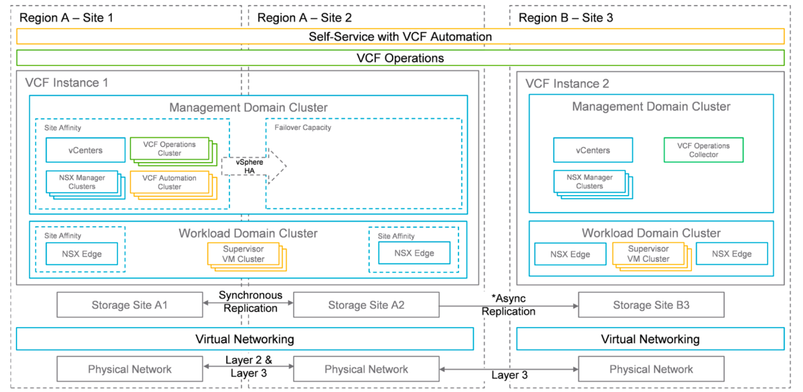

# VCF Design Blueprints and Deployment Topologies

VMware Cloud Foundation (VCF) 9 introduces a set of validated design blueprints. Each blueprint defines a recommended architecture model for a specific deployment scale, resilience level, and operational need. Each blueprint also provides a structured approach for designing management and workload domains, networking, storage, and configurations for fault domains to meet specific enterprise requirements.  
VCF blueprints help standardize infrastructure design across environments while providing flexibility for customization based on business objectives. These blueprints support a range of deployment topologies, from single-site installations to multi-region architectures. Organizations can choose the topology that best aligns with their availability, scalability, and disaster recovery goals.

##  Supported VCF Topology Options

- Single Site / Minimal Footprint - A compact topology suited for small environments, lab setups, or proof-of-concept deployments, where you deploy all components within a single site and availability zone.

- Single Site (Production-Grade) - A single-site topology designed for production use, providing dedicated management and workload domains with full lifecycle management and scalability.

- Multiple Sites within a Single Region - A topology that spans multiple sites or availability zones within a single geographic region, offering improved fault tolerance and availability.

- Multiple Regions / Global Deployment - A distributed deployment across multiple regions for business continuity and disaster recovery, providing geographic redundancy and workload mobility.

Each blueprint defines the logical layout of management components, workload domains, network segmentation, and inter-site connectivity patterns. Organizations can select a blueprint that matches their operational model, redundancy needs, and infrastructure scale.

This reference architecture uses the Multi Region topology.

This topology delivers a clear and scalable foundation for Tanzu GemFire on VMware Cloud Foundation 9 (VCF9). This topology enables agile deployment of GemFire instances across multiple Availability Zones to ensure high availability and fault tolerance. This topology also supports seamless replication across regions to provide robust multi-site resiliency. The design meets the demands of environments that require predictable performance, continuous availability, and simplified operations, effectively supporting a multi-site resiliency model.  
For more information on VCF topologies and blueprints, see the [VMware Cloud Foundation](https://techdocs.broadcom.com/us/en/vmware-cis/vcf/vcf-9-0-and-later/9-0/design/blueprints.html) documentation.

