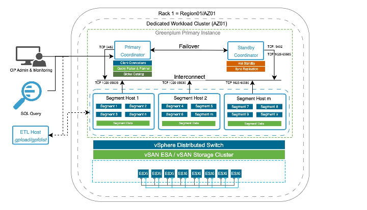

# High-Level Logical Architecture

The diagram below illustrates the high-level logical architecture of Tanzu Greenplum deployed on VMware vSphere. The design aligns Greenplum's Massively Parallel Processing (MPP) execution model with the compute, networking, and storage capabilities of vSphere and vSAN to deliver predictable performance, scalability, and availability for analytical workloads. Greenplum's compute components run as virtual machines on a dedicated vSphere workload cluster, while data durability and availability are provided by vSAN ESA or a vSAN storage cluster.

Greenplum is a shared-nothing MPP database built on PostgreSQL. A single logical database is partitioned across many independent PostgreSQL instances (segments) each of which owns a distinct slice of the data together with its own CPU, memory, and storage.   
A coordinator sits in front of them, authenticates clients, holds the global catalog, parses and plans each query, and dispatches plan fragments to the segments for parallel execution. Segments exchange intermediate results with one another over a dedicated high-speed fabric, the interconnect. Because a query completes only when its slowest segment finishes, uniform and balanced resources across segment VMs are a central design goal of this architecture, a theme carried into the compute and placement sections that follow.  

**Logical components and their platform realization**

**Client and application access:** SQL clients, interactive users, administration and monitoring tools, and ETL utilities such as `gpfdist` and `gpload` connect to the coordinator over the client-access network.   
High-volume external loads are typically driven from one or more dedicated ETL hosts. Other ingest mechanisms exist, including the Platform Extension Framework (PXF) for reading external data sources directly and streaming connectors for message platforms, and these share the same network path and traffic class as the utilities described here. This document uses `gpfdist` and `gpload` as the reference ingest path.

**Coordinator layer:** The Primary Coordinator manages client sessions, owns the global catalog, and performs query parsing, planning, and dispatch. It holds no user data.   
A Standby Coordinator maintains a synchronously replicated copy of the coordinator's state and can be promoted if the primary fails permanently. The coordinator role is retained in all deployments described in this document; its restart and failover semantics are detailed in [Coordinator and Standby Semantics](./vsphere-cluster-design.md#coordinator-and-standby-semantics).

**Segment layer (MPP execution):** User data is distributed across multiple segment hosts, each running several segment instances. Segments execute their fragments of a query in parallel against local data and exchange data through the interconnect as the plan requires. This is where the bulk of query work such as scanning, joining, and aggregating happens.

**Networking layer:** All Greenplum traffic is carried over a vSphere Distributed Switch (vDS). The interconnect is treated as a distinct traffic class and engineered for low latency and high bandwidth, since motion operators and data redistribution during query execution depend on it. The traffic classes, port groups, and teaming design are covered in [Virtual Distributed Switch (vDS) Design](./vds-design.md#virtual-distributed-switch-vds-design).

**Storage layer:** Segment and coordinator data reside on vSAN ESA or a vSAN storage cluster, which provides durability and availability at the storage layer through its own redundancy policies (SPBM/FTT). More details in [Storage Architecture - vSAN & vSAN Storage Cluster](./storage-architecture.md#storage-architecture-vsan-vsan-storage-cluster).

**Compute platform:** All Greenplum virtual machines run on ESXi hosts within a dedicated vSphere workload cluster. Placement rules keep the primary and standby coordinators, and segment VMs, distributed across hosts to preserve Greenplum's failure domains; these rules are defined in [VM Placement and Anti-Affinity Rules](./vsphere-cluster-design.md#vm-placement-and-anti-affinity-rules).

**Logical-to-physical mapping**

| Greenplum logical component | Role (high level) | Realization on vSphere |
| :---- | :---- | :---- |
| Primary Coordinator | Client sessions, global catalog, parse / plan / dispatch, holds no user data | Dedicated VM (TCP 5432 for client access) |
| Standby Coordinator | Synchronously replicated copy of coordinator state, promotable on permanent failure | Dedicated VM, placed on a different ESXi host (anti-affinity) |
| Segment host | Hosts multiple segment instances; owns a slice of the distributed data | VM |
| Segment instance | PostgreSQL process executing query fragments against local data | Process within a segment-host VM |
| Interconnect | Motion / data exchange between segments during query execution | Dedicated vDS traffic class / port group (TCP 1025-65535) |
| Data (segment + coordinator) | Persisted relational data and WAL | vSAN objects governed by SPBM |
| ETL / load path | External ingest via `gpfdist` / `gpload` | ETL host(s) on the client-access network |

Further details on Greenplum workload characteristics and the corresponding vSphere design considerations and recommendations are provided in the subsequent sections.
