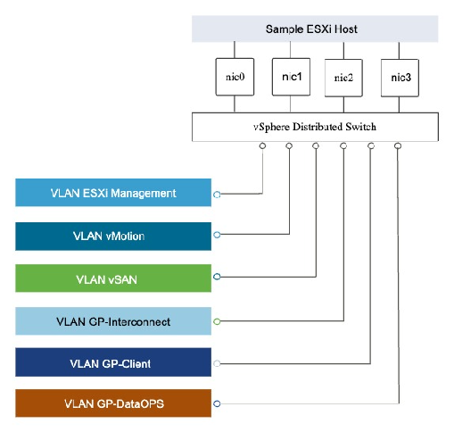
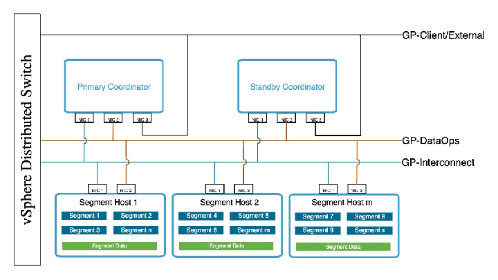

# Virtual Distributed Switch (vDS) Design

This section defines how virtual networking is built for the Greenplum vSphere cluster using a dedicated vSphere Distributed Switch (vDS) and VLAN-backed port groups. It explains how each traffic class (interconnect, vSAN, client, management, vMotion, and data operations) is isolated, and how uplinks and teaming policies are chosen to give the latency-critical flows deterministic, low-jitter paths that hold up under contention.

The design is written so that an administrator with general vSphere knowledge can implement the prescribed port groups, VLANs, and NIC mappings without needing Greenplum-specific expertise. The reasoning behind each choice traces back to the network characteristics established in [Network Traffic Characteristics](./workload-characteristics.md#network-traffic-characteristics).

## Design Objectives

Greenplum is a shared-nothing MPP system that generates intense east-west traffic between segment hosts and is highly sensitive to latency variance and packet loss, as established in [Network Traffic Characteristics](./workload-characteristics.md#network-traffic-characteristics). The virtual network must therefore:

* Provide deterministic packet paths and predictable failover behavior, so motion traffic follows a known route and does not shift underneath a running query.  
* Minimize processing overhead and avoid the jitter that dynamic, load-based teaming can introduce.  
* Isolate the latency-critical interconnect and storage traffic from the less critical flows, so that management, vMotion, or ETL activity can never contend with motion operators or vSAN I/O.

For these reasons the architecture uses a vSphere Distributed Switch with VLAN-backed networks for all Greenplum and vSAN traffic, and keeps overlay networking off the Greenplum data path. The next section explains that choice in relation to NSX, which is a capable alternative.

## Networking Technology Choice - vDS or NSX

Both vDS with VLAN-backed port groups and NSX overlay networking are valid, fully supported ways to build the network for Greenplum on vSphere. They optimize for different things, and the right choice depends on what the surrounding environment needs.

**Where NSX is a strong fit.** NSX brings capabilities that a plain vDS does not: distributed firewalling and micro-segmentation, multi-tenant network isolation, automation through a rich API, and consistent logical networking that spans clusters and sites. 

In an environment that is already standardized on NSX, or where Greenplum sits inside a larger multi-tenant SDDC with security-segmentation requirements, running Greenplum on NSX is a reasonable and well-supported design. The operational consistency of managing one network model across the whole estate can outweigh a modest data-path cost.

**Why does this architecture use vDS.** The consideration that dominates for the Greenplum data path is deterministic, low-jitter east-west performance. NSX overlays using Geneve add per-packet encapsulation and decapsulation, an extra processing stage in the hypervisor datapath, and additional logical hops. For most workloads that overhead is negligible and well worth the features it buys. For the Greenplum interconnect specifically, which is bursty, highly parallel, and sensitive to jitter and tail latency during motion operators, the simplest possible path is the most predictable one. A VLAN-backed vDS gives exactly that:

* The lowest packet-processing overhead, with no encapsulation or decapsulation on the data path.  
* Fewer buffering and queueing points between segments.  
* Predictable latency and drop behavior under bursty motion load.

**The decision for this document.** This reference architecture uses a vSphere Distributed Switch with VLAN-backed port groups and end-to-end jumbo frames (MTU 9000) for all Greenplum traffic and all vSAN client traffic. Where NSX is present in the broader SDDC, it is reserved for non-Greenplum workloads on this platform. NSX is best understood here as the second choice for the Greenplum data path: fully capable and the right answer when its segmentation and multi-tenancy features are required, but carrying an overlay cost that a dedicated, single-tenant Greenplum cluster does not need to pay. 

## vSphere Distributed Switch Design for Greenplum

This diagram shows the vSphere Distributed Switch (vDS) design used to support Greenplum workloads. The design follows a multi-NIC, multi-VLAN model to provide bandwidth isolation, fault tolerance, and scalability across management, storage, and database traffic. More details on the NIC Mapping and Traffic control is discussed in further sections.

The vDS implementation follows these core principles: 

* Centralized Network Management   
  All VLANs, port groups, and traffic classes are consistently defined and enforced across the cluster.   
* Traffic Isolation by Design   
  Each Greenplum traffic type is mapped to a dedicated port group, ensuring logical separation at Layer 2.   
* Host-Independent Behavior   
  VM networking behavior remains consistent regardless of which ESXi host the VM runs on, simplifying HA and DRS operations.

### Uplink Count Options

Each ESXi host in the Greenplum cluster uses one of two uplink counts:

* **Minimum production design:** 4 physical uplinks per host.  
* **Preferred design:** 6 physical uplinks per host, for larger or more critical clusters.

Both designs preserve strict separation of vSAN client traffic and Greenplum interconnect traffic onto different port groups with consistent Active/Standby teaming. 

The difference between them, examined in [Uplink Teaming Policy](#uplink-teaming-policy), is that 6 uplinks let interconnect and vSAN each own a dedicated NIC pair, which removes a shared-failure risk that the 4-uplink design has to accept.

## Network Logical Architecture on vSphere

This section describes the logical network architecture used for deploying Greenplum Database on the vSphere platform. The design focuses on strict traffic separation, predictable query performance, and operational stability.

Greenplum traffic is logically segmented into distinct network types using a vSphere Distributed Switch (vDS). Each traffic type serves a specific functional role within the database and infrastructure stack, and is isolated at the VLAN and port-group level to prevent resource contention.

### Network Segmentation and Traffic Classes

The following logical networks are used across ESXi hosts, Coordinator and Segment VMs. Each traffic type must use a dedicated VLAN and port group.

| Traffic Type  | Portgroup (example) | Purpose |
| ----- | ----- | ----- |
| Management | PG-Mgmt | ESXi/vCenter management, SSH, monitoring agents |
| vMotion | PG-vMotion | vMotion for planned maintenance |
| Greenplum Interconnect | PG-GP-Interconnect | Segment to segment data exchange, motion operators |
| Client Access/External Access | PG-GP-Client | Apps to Coordinator/Standby connections |
| Data Operations | PG-GP-DataOps | ETL, gpfdist, and backup/restore traffic |
| vSAN / vSAN Storage Cluster | PG-vSANClient | ESXi vmkernel traffic to vSAN datastores |

Refer to [Greenplum Database Ports and Protocols documentation](https://techdocs.broadcom.com/us/en/vmware-tanzu/data-solutions/tanzu-greenplum/7/greenplum-database/security-guide-topics-ports_and_protocols.html) for more details on ports and protocol usage.

Key principle:

* Greenplum interconnect and vSAN traffic must never share VLANs or portgroups.  
* Interconnect and vSAN each get their own VLAN, queues, and uplink assignments, preventing storage IO and motion operators from contending directly.

All portgroups are VLAN-backed on the vDS with no overlays on the data path.

## Uplink Teaming Policy

### Policy Decision

For Greenplum interconnect and vSAN/vSAN Storage Cluster client traffic, the architecture recommends:

* Active/Standby uplink teaming with explicit failover order on the vDS.

This may also be applied to Client Access for deterministic pathing in critical deployments.

### Why Active/Standby Is Preferred

Although vSphere supports Active/Active and Load-Based Teaming (LBT), these do not behave like true bandwidth aggregation for vmkernel and latency-sensitive flows:

* vSAN and other vmkernel flows typically use a single active uplink at a time, LBT may move flows between uplinks over time.  
* Dynamic uplink switching can introduce jitter, route changes, and out-of-order delivery that are difficult to diagnose for Greenplum motion traffic.  
* LACP/MC-LAG on ToR switches adds complexity and is not required for vSAN or Greenplum interconnect.   
  VMware guidance for vSAN strongly favors simple, deterministic teaming.

Active/Standby provides:

* Predictable packet paths (one known active uplink per portgroup/vmk).  
* Simple, clean failover behavior only on physical link failure.  
* No dependence on switch-side LACP or proprietary MLAG behavior.

This matches guidance for vSAN networking and aligns well with the Greenplum requirement for stable, low-jitter paths.

### Uplink Usage

The mappings below assume dual-port NICs, since that is the most common building block. Production hardware may use NICs with 1, 2, or 4 ports, and the same principles apply once the port groups are laid out across whatever physical cards are present.

**Assumed NIC Layout:**

This reference architecture assumes NICs with 2 uplinks for the examples that follow.

For 4 Uplinks Hosts:

* NIC Card 1: vmnic0, vmnic1 @ 10/25 Gbps (lower bandwidth)  
* NIC Card 2: vmnic2, vmnic3 @ 40/100 Gbps (higher bandwidth)

For 6 Uplink Hosts: 

* NIC Card 1: vmnic0, vmnic1 @ 10/25 Gbps (lower bandwidth)  
* NIC Card 2: vmnic2, vmnic3 @ 40/100 Gbps (higher bandwidth)  
* NIC Card 3: vmnic4, vmnic5 @ 40/100 Gbps (higher bandwidth)

**Note on mixed-speed NICs**

This Reference Architecture does not recommend deliberately sizing Greenplum clusters with lower-bandwidth NICs for any traffic class. The designs shown here for 4-uplink hosts assume a scenario where the server hardware already has a mixed NIC configuration (for example, 2 x 10/25G and 2 x 40/100G).

If all NICs can be 25G or higher, that is strongly preferred and simplifies the design.

* If mixed NIC speeds are unavoidable, the mappings in the further sections provide a safe way to:  
  * Keep Greenplum Interconnect and vSAN Storage Cluster client traffic on the highest-bandwidth NICs at all times.  
  * Use lower-bandwidth NICs only for management, vMotion, and optionally GP-Client/DataOps.

When hosts have homogeneous high-bandwidth NICs, use them for all traffic classes as per the 6-uplink table below. The split between 'low-bandwidth for mgmt' and 'high-bandwidth for data' is only for hardware that already ships with such a distinction; it is not a requirement or a cost-optimization recommendation for new designs.

#### 4-Uplink Host Configuration (Minimum Production)

In this layout the two high-bandwidth ports on Card 2 carry both of the heavy flows, interconnect and vSAN, while Card 1 carries the lighter flows.

**NIC Mapping:**

* NIC Card 1 (10/25G):  
  * vmnic0, vmnic1 - used for Management, vMotion, GP-Client, DataOps (lower bandwidth).  
* NIC Card 2 (40/100G):  
  * vmnic2, vmnic3 - used for GP-Interconnect and vSAN Storage Cluster (heavy paths).

**Portgroup -> Uplink mapping (Active/Standby)**

| Portgroup | Active Uplink | Primary Standby  | Secondary Standby | Notes |
| ----- | ----- | ----- | ----- | ----- |
| PG-GP-Interconnect | vmnic2 | vmnic3 | vmnic 0 | Primary GP motion traffic. Always on high-bandwidth NIC (Card 2), primary failover within the same card. Can fail over to low-bandwidth uplink if Card 2 fails. (Priority set priority via NIOC) |
| PG-vSAN-Client  | vmnic3 | vmnic2 | vmnic 1 | vSAN Storage Cluster vmkernel NICs Always on high-bandwidth NIC (Card 2), primary failover within the same card.  Can fail over to low-bandwidth uplink if Card 2 fails. (Priority set priority via NIOC) |
| PG-GP-Client  | vmnic0 | vmnic1 | vmnic 3 | Client to coordinator. Primary on Card 1, primary failover within the same card.  Can fail over to high-bandwidth uplink if Card 1 fails. (Priority set priority via NIOC) |
| PG-GP-DataOps | vmnic1 | vmnic0 | vmnic 3 | ETL/backup traffic. Primary on Card 1, primary failover within the same card.  Can fail over to high-bandwidth uplink if Card 1 fails. (Priority set priority via NIOC) |
| PG-vMotion | vmnic1 | vmnic0 | vmnic 2 | vMotion vmkernel. Confined to lower-bandwidth NIC (Card 1), used only for planned maintenance. Primary on Card 1, primary failover within the same card.  Can fail over to high-bandwidth uplink if Card 1 fails. (Priority set priority via NIOC) |
| PG-Mgmt  | vmnic0 | vmnic1 | vmnic 3 | Mgmt vmk0. Confined to lower-bandwidth NIC (Card 1). Primary on Card 1, primary failover within the same card.  Can fail over to high-bandwidth uplink if Card 1 fails. (Priority set priority via NIOC) |

**Network I/O Control (NIOC) Shares**

The single most important thing to understand about NIOC here is that shares only arbitrate between flows that are contending for the *same physical uplink*. In normal operation, interconnect is active on vmnic2 and vSAN is active on vmnic3, so they are on different NICs and do not compete; the shares do nothing. 

Shares become active only on failover, when a flow moves onto a NIC that another flow is already using. The values below are therefore set to decide who wins *when a collision happens*, and the important guarantees are on Card 2, where the two heavy flows can end up sharing one port.

On the Card 2 high-bandwidth uplinks (vmnic2 and vmnic3):

| Portgroup | Shares Value | Limit | Uplink Mapping Active / Primary Standby / Secondary Standby |
| ----- | ----- | ----- | ----- |
| PG-GP-Interconnect  | 60 | None | vmnic 2 / vmnic 3 / vmnic 0 |
| PG-vSAN-Client  | 30 | None | vmnic 3 / vmnic 2 / vmnic 1 |
| PG-GP-Client | 8 | None | vmnic 0 / vmnic 1 / vmnic2 |
| PG-GP-DataOps | 2 | None | vmnic 1 / vmnic 0 / vmnic3 |

On the Card 1 control uplinks (vmnic0 and vmnic1):

| Portgroup | Shares Value | Limit | Uplink Mapping Active / Primary Standby / Secondary Standby |
| ----- | ----- | ----- | ----- |
| PG-Mgmt | 50 | None | vmnic 0 / vmnic 1 / vmnic 2 |
| PG-vMotion | 20 | None | vmnic 1 / vmnic 0 / vmnic 3 |

What these values buy you:

* If Card 1 fails, GP-Client and DataOps fail over to Card 2. Their low share values (8 and 2) mean that when they land next to interconnect and vSAN, they can only take what is left after the heavy flows are served.  
* If one Card 2 port fails, interconnect and vSAN collapse onto the single surviving Card 2 port and now genuinely contend. The 60-to-30 share ratio gives interconnect priority while still leaving vSAN a guaranteed floor, which is the behavior you want during a degraded window.  
* If Card 2 fails entirely, interconnect and vSAN fall back to the secondary standby on Card 1. Both heavy flows drop from 40/100G to 10/25G at the same time and share that card with management and vMotion. The shares still order traffic correctly, but they are now arbitrating a fraction of the designed bandwidth.  
* This secondary standby exists to keep the storage path alive. Losing interconnect stops queries; losing the vSAN path can make VM storage inaccessible and take VMs down. A slow route to storage is the difference between a degraded cluster and a failed one.  
* No performance expectation should be set for the Card 1 fallback state. The cluster stays available and data stays accessible, but queries may run many times longer and some may time out. It is a survival path for scheduling a repair, not an operating mode, and sizing must never assume it.  
* Under normal conditions GP-Client runs on 10/25G, which is appropriate because analytic client traffic is control-heavy (session setup and result sets) rather than bandwidth-heavy. On failover to Card 2 it may see higher throughput, which is a harmless exception state.

**Accepted risk of the 4-uplink design.** Both heavy flows depend on Card 2 for their normal-performance path, so a failure of the card as a whole (a dual-port NIC fault, a bad PCIe slot, or a driver failure) moves interconnect and vSAN onto the low-bandwidth card together. The secondary standby prevents this from halting the cluster, but it leaves the entire workload running in the severely degraded state described above until the card is replaced, so it is an emergency condition requiring immediate repair rather than a tolerable operating state. This is the fundamental limitation of the 4-uplink minimum, and it is the main reason the 6-uplink design is preferred for anything critical, since there interconnect and vSAN have dedicated pairs on separate cards and a card failure degrades one flow rather than both. Where 4 uplinks must be used and this risk matters, it can be reduced by drawing vmnic2 and vmnic3 from two separate physical dual-port cards rather than one, so that "Card 2" is really two cards and no single card carries both heavy flows.

#### 6-Uplink Host Configuration

The six-uplink layout removes the shared-card risk by giving interconnect and vSAN each their own dedicated high-bandwidth pair.

**NIC Mapping:**

* NIC Card 1 (10/25G):  
  * vmnic0, vmnic1 - used for Management, vMotion, GP-Client, DataOps (lower bandwidth, cheaper ports).  
* NIC Card 2 (40/100G):  
  * vmnic2, vmnic3 - high bandwidth, data plane  
* NIC Card 3 (40/100G):  
  * vmnic2, vmnic3 - high bandwidth, data plane

**Portgroup -> Uplink mapping (Active/Standby)**

| Portgroup | Active Uplink | Standby Uplink | Notes |
| ----- | ----- | ----- | ----- |
| PG-GP-Interconnect | vmnic2 | vmnic3 | Primary GP motion traffic. Dedicated high-bandwidth pair for motion operators. |
| PG-vSAN-Client  | vmnic4 | vmnic5 | vSAN vmkernel NICs. Dedicated high-bandwidth pair for storage IO. |
| PG-GP-Client | vmnic3 | vmnic2 | Client to coordinator. Primary on Card 2. Client traffic on interconnect pair (low priority via NIOC). |
| PG-GP-DataOps | vmnic5 | vmnic4 | ETL/backup on vSAN pair (low priority, and rate-limited via NIOC). |
| PG-vMotion | vmnic1 | vmnic0 | vMotion vmkernel. Confined to lower-bandwidth NIC (Card 1). |
| PG-Mgmt  | vmnic0 | vmnic1 | Mgmt vmk0. Confined to lower-bandwidth NIC (Card 1). |

**Network I/O Control (NIOC) Shares**

On high-bandwidth uplinks (vmnic2-5):

| Portgroup | Shares Value | Limit | Uplink Mapping Active/Standby |
| ----- | ----- | ----- | ----- |
| PG-GP-Interconnect  | 80 | None | vmnic 2 / vmnic 3  |
| PG-GP-Client  | 20 | None | vmnic 3 / vmnic 2  |
| PG-vSAN-Client  | 80 | None | vmnic 4 / vmnic 5  |
| PG-GP-DataOps | 20 | 50% | vmnic 5 / vmnic 4  |

On control uplinks (vmnic0-1):

| Portgroup | Shares Value | Limit | Uplink Mapping Active/Standby |
| ----- | ----- | ----- | ----- |
| PG-Mgmt | 70 | None | vmnic 0 / vmnic 1 |
| PG-vMotion | 30 | None | vmnic 1 / vmnic 0 |

Why this layout is preferred:

* **Clean isolation of the heavy flows.** Interconnect owns Card 2 and vSAN owns Card 3, so in normal operation they never share silicon. The 80-to-20 share ratios only come into play for the light co-tenant on each pair (GP-Client on the interconnect pair, DataOps on the vSAN pair), and DataOps stays rate-limited so a backup cannot disturb vSAN.  
* **Predictable failover with no cliffs.** A single port failure on Card 2 keeps interconnect on the other Card 2 port; the same is true for vSAN on Card 3. GP-Client stays on high-bandwidth NICs throughout. A Card 1 failure only affects management and vMotion, which fail over within Card 1. A top-of-rack failure is absorbed by the Active/Standby pairing.  
* **No whole-card single point of failure for the data plane.** Losing an entire Card 2 takes interconnect down to its standby behavior but leaves vSAN fully intact on Card 3, and vice versa, so a single card fault never removes both heavy flows at once. This is the specific weakness of the 4-uplink design that six uplinks resolve.

## Firewall and Port Requirements

The preceding sections separate traffic into isolated Layer 2 segments. This subsection defines the flows that must be permitted for the cluster to function, expressed as source, destination, port, and protocol, and grouped by the port group that carries them.

### Interconnect Cannot Be Port-Filtered

The Greenplum interconnect does not use fixed ports. It moves tuples between segments over the dynamically allocated range 1025 to 65535, on both UDP and TCP, and the same range carries transient connections for query execution, data movement, and statistics collection. Ports are assigned per query, so there is no small, stable set to permit.

Traffic between segment hosts on the interconnect network must therefore flow freely across the full range. Restricting it to specific ports breaks query execution intermittently and is very hard to diagnose. This is why the interconnect sits on its own isolated VLAN and port group: the open range is safe because nothing else shares the segment, and enforcement happens at the segment edge rather than between segments.

**Note:** The segment SQL client ports, used by the coordinator to coordinate with segments, are also not a fixed set. They are assigned at initialization or expansion, recorded in `gp_segment_configuration`, and viewable with `gpstate -p`.

### Required Flows

Abbreviations used below: 

* Client for SQL clients, applications, and tools.  
* Coordinator and Standby for the coordinator VMs.  
* Segments for all segment hosts.  
* ETL for load and backup hosts.  
* Mgmt for the administration network.

**Client and coordinator access (PG-GP-Client)**

| Source | Destination | Port / Protocol | Description |
| :---- | :---- | :---- | :---- |
| Client | Coordinator | TCP 5432, libpq | SQL client connections. Configurable. |
| Client | Standby | TCP 5432, libpq | Client listener on the standby, usually the same port. |

**Interconnect and segment coordination (PG-GP-Interconnect)**

| Source | Destination | Port / Protocol | Description |
| :---- | :---- | :---- | :---- |
| Segments | Segments | UDP and TCP 1025-65535, dynamic | Interconnect tuple movement. Open across the full range within the segment. |
| Coordinator | Segments | Varies, libpq | Coordinator-to-segment coordination. Ports per `gpstate -p`. |
| Coordinator | Standby | TCP 1025-65535, gpsyncmaster | WAL replication to the standby coordinator. |

**Note:** These flows stay within the isolated interconnect segment. Do not enumerate ports; permit the range.

**Data operations, load, and backup (PG-GP-DataOps)**

| Source | Destination | Port / Protocol | Description |
| :---- | :---- | :---- | :---- |
| ETL | Segments, Coordinator | TCP 8080 HTTP, TCP 9000 HTTPS | gpfdist and gpload parallel file transfer |
| Segments, Coordinator | S3 endpoint | TCP 443, HTTPS | Backup and restore to S3, the preferred target ([Greenplum Backup and Restore](./backup-and-restore.md#greenplum-backup-and-restore)) |
| Segments, Coordinator | Data Domain | TCP/UDP 111, TCP 2049, 2052, 2051 | NFS portmapper, NFS, mountd, and replication, where Data Domain is used |
| Coordinator | SMTP relay | TCP 25 or 587 | Optional backup completion email |

**Management and administration (PG-Mgmt)**

| Source | Destination | Port / Protocol | Description |
| :---- | :---- | :---- | :---- |
| Mgmt | All cluster hosts | TCP 22, SSH | Used by most management utilities, including gpssh, gppkg, gpbackup, gprestore |
| Coordinator, Segments | All cluster hosts | TCP 22, SSH | Intra-cluster orchestration by the same utilities |
| Mgmt | Coordinator, Standby | TCP 28080, HTTP/HTTPS/WS | GPCC web service. Configured at install. |
| Segments | GPCC host | TCP 8899 | GPCC agents connecting to the web service host |
| Segments | Segments | TCP 5888 | PXF service, where PXF is deployed |

**Note:** The flow list is limited to components this design deploys. Add-on connectors (GemFire, NiFi, Spark, GPText, and others) have their own ports and should be added against the matching traffic class if introduced.

### Design Guidance

* Permit intra-cluster east-west traffic at the segment boundary, including the full dynamic interconnect range. Enforce at the edge of each segment, not between segment hosts.  
* Firewall the north-south paths, client access, data operations, and management, where policy adds value.  
* Keep the coordinator client port reachable from the client network, and the SSH and GPCC paths reachable from the management network only.

**Note:** Under NSX, these same source-to-destination flows become distributed firewall rules. The interconnect rule must permit the full dynamic range within the segment rather than enumerating ports. The dedicated NSX reference architecture covers that rule set.
